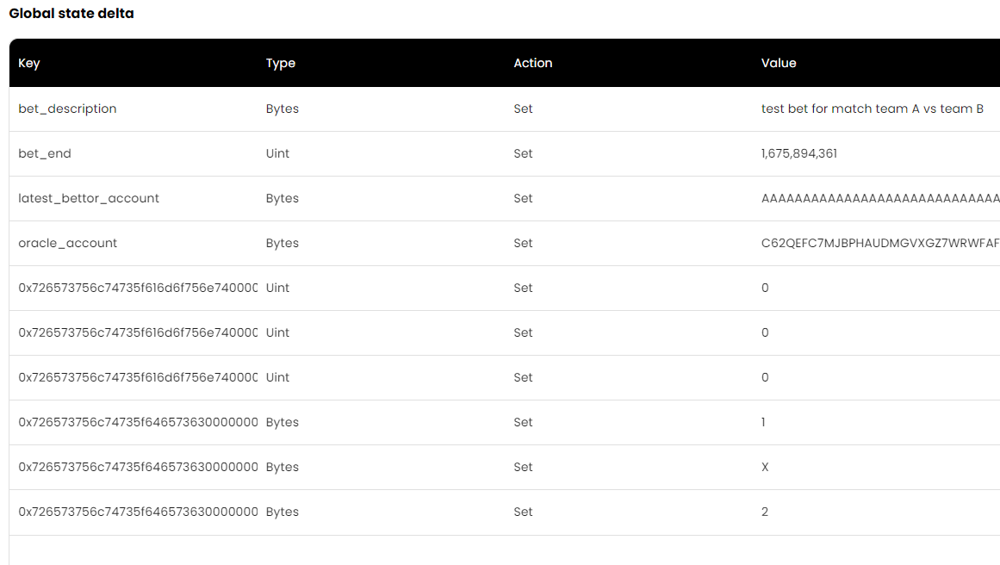

# Hackathon: Algorand Greenhouse Hack 3
# Learning Challenge: Box Storage With Beaker
# Bet contract - Bet Algos 4 FUN (ba4f) 

## Introduction

Submission for greenhouse 3 hack - https://gitcoin.co/issue/29662

This project presents a Bet contract that uses boxes to store
bettors amounts relative to a result that is set from an oracle
address.

## Files

- [bet contract](./smart_contracts/bet.py)
- [demo sandbox localnet](./deploy_sandbox.py)
- [demo testnet](./deploy_testnet.py)

## Video demostration
Algorand Greenhouse Hack 3 -Learning Challenge: Box Storage With Beaker Bet contract
- [youtube video](https://youtu.be/4Ylo40Jm4UM)

## why boxes ?

Boxes have some advantages over local store for App.
- no need to optin to use them (nice one less txn/fee/MBR)
- there can be as many boxes as app needs (no one more no one less!)
- can have any internal structure
- can be deleted ie retreive its MBR when deleting app
- on chain App is the only one that can read a box.
  As always off-chain anyone can read anything

However, boxes have some drawbacks.
- You have to ensure box name is unique 
- If an app is deleted, its boxes are not deleted. You have to delte boxes
  before in order to get thier MBR back
- If you access a box in a txn you must add it to boxes params

In case of a bet contract, that can have a lot of bettors or just a few,
boxes make sense! Small MBR, no need to optin. Cannot be read on chain
by other contracts.

## implemetation

Contract [bet.py](./smart_contracts/bet.py) uses beaker mapping to
create boxes with `bettor address` as `key `and a `named tuple`
as its value containing a `result Uint64` as bet predicted result and 
`amount Uint64` as the amount betted.

```python
# Bettors record Box format
class BettorRecord(abi.NamedTuple):
    result: abi.Field[abi.Uint64]
    amount: abi.Field[abi.Uint64]

# Boxes
bettor_records = Mapping(
    abi.Address,
    BettorRecord,)
```

It's important to operate boxes MBR before hand to ensure MBR 
for your app:

```python
 
_bettor_record_box_size = abi.size_of(BettorRecord)
_bettor_record_key_box_size = abi.size_of(abi.Address)
BoxFlatMinBalance = 2500
BoxByteMinBalance = 400
# Box MBR value 
_min_balance_per_box = (
        BoxFlatMinBalance
        + (_bettor_record_box_size + _bettor_record_key_box_size) * BoxByteMinBalance
    )
```

In this case 

$bettorRecordBoxSize = 8\cdot2 = 16 \space bytes$

$bettorRecordBoxKeySize = addressSize = 32 \space bytes$

$2500 + (16 + 32)\cdot400 = 21 700 \space \mu Algo$


To write a box you have to store it inside an abi value:

```python
output: BettorRecord
(result := abi.Uint64()).set(1)
(amount := abi.Uint64()).set(10_000_000)
...
output.set(result, amount)
self.bettor_records[Txn.sender()].set(output),
```

To read from it: 

```python
# output to hold values 
output: BettorRecord
result: abi.Uint64
# ensure box exist maybe not usefull for your
# use case 
Assert( self.bettor_records[payment.get().sender()].exists() )
self.bettor_records[payment.get().sender()].store_into(output),
# then 
output.result.store_into(result),
# or 
output.result.use(lamba x: ... )
```

Don't forget to add any box your app call uses to the boxes
in the transaction, encoding data to bytes. To encode an address
use encoding.decode_address(account.address).

```python
    result = app_client.call(
        Bet.place_bet,
        payment=make_tws(account, amount),
        result=bet_result,
        boxes=[
            [
                app_client.app_id,
                encoding.decode_address(account.address),
            ],  # type: ignore
        ],
        signer=account.signer,
        suggested_params=algod_client.suggested_params(),
    )
```

## boxes off chain

Use algo indexer to get boxes.

Note that boxes names are base64 encoded bytes so 
you have to decode it before usage.

```python
import base64
...
boxes: list[dict[str, str]] = algoidx_client.application_boxes(app_client.app_id)[
    "boxes"
]
boxes_array: list[tuple[int, bytes]] = []
for b_ in boxes:
    box: tuple[int, bytes] = (app_client.app_id, base64.b64decode(b_["name"]))
    boxes_array.append(box)
...
```

If your box key is an address you can get it back encoding bytes to string ie 

```python
encoding.encode_address(box_bytes)
```


## Contract

Contract is located [here bet.py](./smart_contracts/bet.py)
See comments for more information.

## Get contract Artifacts

In vscode just press `F5` to launch debugging.
If no errors folder [./smart_contracts/artifacts/bet.Bet/](./smart_contracts/artifacts/bet.Bet/) contains compiled teal code and json abi files.

You can also simply run 
```console
python -m smart_contracts 
```
from root directory to generate artifact.


## Demo app in sandbox

### How to run 

First install algokit: [Algokit Setup](#algokit-setup) and run 
sandbox localnet:
```console
(venv-py3.11) algokit sandbox start
docker: Container algokit_algod  Created
docker: Container algokit_postgres  Created
docker: Container algokit_indexer  Created
docker: Container algokit_algod  Starting
docker: Container algokit_postgres  Starting
docker: Container algokit_algod  Started
docker: Container algokit_postgres  Started
docker: Container algokit_indexer  Starting
docker: Container algokit_indexer  Started
docker: Container algokit_indexer  Waiting
docker: Container algokit_postgres  Waiting
docker: Container algokit_algod  Waiting
docker: Container algokit_indexer  Healthy
docker: Container algokit_postgres  Healthy
docker: Container algokit_algod  Healthy
Started; execute `algokit sandbox status` to check the status.
```

Then install additional requirement in your python venv

```console 
pip install -r .\requirements.txt
```

And run deploy_sandbox.py script.
```console
python .\deploy_sandbox.py
```
It uses all contract functions, note that it ends 
**deleting the app and sending all remaining founds to 
creator address** (only creator account can delete the app).

Run 
```console
algokit sandbox explore
```

in order to check bet contract transactions and accounts balances.

Remember Application has been removed so trying to access it gives:
https://app.dappflow.org/explorer/application/1/transactions


Transaction are here:
https://app.dappflow.org/explorer/transactions

You can check app state deltas:


Dive into [bet.py](./smart_contracts/bet.py) functions
for details about boxes management and functions calls.


### sanbox error

If you encounter an error like:
```console
beaker.client.logic_error.LogicException: Txn XXXXXXXX
had error 'assert failed pc=1144' at PC 1144 and Source Line 676:

        global LatestTimestamp
        bytec_3 // "bet_end"
        app_global_get
        <
        // bet window must be open
        assert          <-- Error

```
Try to reset localnet:

```console
algokit sandbox reset 
```

or increase bet window time:

```python
# call the method start method
result = app_client.call(
    Bet.start_bet,
    description="test bet for match team A vs team B",
    results=["1", "X", "2"],
    bet_lenght=120, # 120sec ~ 2min increment if needed
    oracle=creator.address,
)
```

This should solve the issue.

## Demo app in testnet

### How to run 

First populate .env file as [.env.template](./smart_contracts/.env.template)
explains.

Go to https://bank.testnet.algorand.network/ dispenser and fund
all your test accounts with at least 10 Algos (deploy script will test that).


Then run
```console 
pip install -r .\requirements.txt
```

And .\deploy_testnet.py script.
```console
python .\deploy_testnet.py
```

explore testnet: https://testnet.algoexplorer.io/

Console output line 
```console
App created [XXX..XXX] with app id {app_id} and addr [XXX...XXX]
```
Will give our app id and you can check
https://testnet.algoexplorer.io/application/{app_id}

For transactions and also check app is closed:


# Setup

This project has been generated using AlgoKit. See [Algokit Setup](#algokit-setup) for default getting started instructions.

# Algokit Setup

### Initial setup

1. Clone this repository: `git clone https://github.com/nabetse00/ba4f`
2. Install pre-requisites:
   - If you have AlgoKit installed, run `algokit bootstrap poetry` within this folder;
   - or:
     - Install `Python` - [Link](https://www.python.org/downloads/): The minimum required version is `3.10`. Ensure you can execute `python -V` and get `3.10`+.
     - Install `Poetry` - [Link](https://python-poetry.org/docs/#installation): The minimum required version is `1.2`. Ensure you can execute `poetry -V` and get `1.2`+.
     - If you're not using PyCharm, then run `poetry install` in the root directory (this should set up `.venv` and also install all Python dependencies) - PyCharm will do this for you automatically on startup 🪄.
3. Open the project and start debugging / developing via:
   - VS Code
     1. Open the repository root in VS Code
     2. Install recommended extensions
     3. Hit F5 (or whatever you have debug mapped to) and it should start running with breakpoint debugging.
        (**NOTE:** The first time you run, VS Code may prompt you to select the Python Interpreter. Select python from the .venv path within this project)
   - IDEA (e.g. PyCharm)
     1. Open the repository root in the IDE
     2. It should automatically detect it's a Poetry project and set up a Python interpreter and virtual environment.
     3. Hit Shift+F9 (or whatever you have debug mapped to) and it should start running with breakpoint debugging.
   - Other
     1. Open the repository root in your text editor of choice
     2. In a terminal run `poetry shell`
     3. Run `python -m smart_contracts` through your debugger of choice

### Subsequently

1. If you update to the latest source code and there are new dependencies you will need to run `poetry install` again
2. Follow step 3 above

# Tools

This project makes use of Python to build Algorand smart contracts. The following tools are in use:

- [Poetry](https://python-poetry.org/): Python packaging and dependency management.- [Black](https://github.com/psf/black): A Python code formatter.
- [Ruff](https://github.com/charliermarsh/ruff): An extremely fast Python linter.

- [mypy](https://mypy-lang.org/): Static type checker.

It has also been configured to have a productive dev experience out of the box in VS Code, see the [.vscode](./.vscode) folder.
